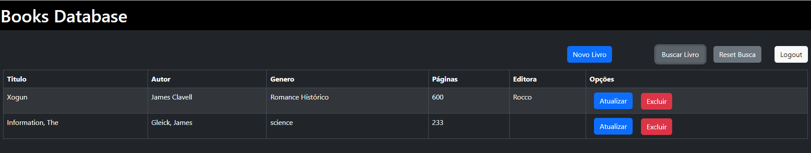

# Books Database - Seu Database de Livros

Um aplicativo em React que permite aos usuários visualizar e gerenciar uma coleção de livros. 

Este projeto foi desenvolvido com a intenção de fornecer uma interface amigável e intuitiva para gerenciar informações sobre livros, incluindo nome, autor, gênero e editora., usando React, HTML, CSS e Bootstrap. 

A aplicação exige autenticação em tela de login para acesso a tela de gerenciamento, está conectada a [API - CRUD de Livros](https://github.com/gerusalobo/API-Livros) documentada previamente, a qual permite realizar as operações CRUD (Create, Read, Update, Delete) para gerenciar informações sobre livros, como nome, autor, gênero, número de páginas e editora.

Segue vídeo de Apresentação da Solução: https://youtu.be/cdRwEPjCCrA


## Acesso a Aplicação

A Aplicação está ativa como um serviço em um servidor linux Mint local com o MongoDB no Atlas.

Url de Acesso a Aplicação:

http://sol.librian.info:3001

Credenciais de Acesso:
- username: teste
- password: XPe4nqo54ent6!hDkairn#76mdj3os1


## Funcionalidades

- **Autenticação**: Sistema de login para garantir que apenas usuários autorizados possam acessar as informações. 
- **Visualização de Livros**: Liste todos os livros disponíveis na coleção.

- **Filtro de Livros**: Filtre a lista de livros por nome, autor, gênero, editora e número de páginas.
- **CRUD**: Liste, Visualize, Crie, Edite e Exclua livros.
- **Responsividade**: Interface adaptável para diferentes tamanhos de tela.


## Estrutura do Projeto

 **`public/`**:

- Contém arquivos estáticos que não precisam passar pelo processamento do Webpack.
- O `index.html` é o ponto de entrada do seu aplicativo. Aqui, o React será montado.

**`src/`**:

- **`components/`**: Armazena componentes reutilizáveis que podem ser utilizados em várias partes do aplicativo. Cada componente geralmente possui sua própria pasta, que pode conter arquivos de estilo e testes.
  - **`Home/`**:Definições para renderização da tela Inicial com formulário de login.
  - **`Header/`**:Definições para renderização do header usado na Tela de Books
  - **`Books/`**:Definições para renderização do header, chamadas de API e modals para a tela Books.
  - **`Login/`**:Definições do formulário de login.
- **`utils/withRouter`**: É uma função que permite que um componente React tenha acesso a propriedades relacionadas ao roteamento, como `navigate`, `location` e `params`, que são fornecidas pela biblioteca `react-router-dom`. Isso é útil quando se deseja que um componente que não é diretamente uma rota tenha acesso a essas funcionalidades de roteamento.
- **`context/`**: Usado para armazenar arquivos que definem Contexts do React, permitindo o gerenciamento de estado global.
  - **`AuthContext/`**: cria o contexto de autenticação.
  - **`ContextProvider/`**: realiza o procedimento de autenticação junto a API.
- **`App.js`**: O componente principal que contém a estrutura do aplicativo. Geralmente é aqui que as rotas são definidas.
- **`index.js`**: O ponto de entrada do React, onde o componente `App` é montado no DOM.

**Arquivos na Raiz**:

- **`.env`**: Usado para armazenar variáveis de ambiente, como chaves de API e URLs.
- **`.gitignore`**: Especifica quais arquivos ou diretórios devem ser ignorados pelo Git.
- **`package.json`**: Contém informações sobre o projeto, incluindo dependências, proxy, porta e scripts de execução.
- **`README.md`**: Documentação do projeto, incluindo instruções de instalação, uso e contribuição.


### Home.js

O componente `Home` é uma página de autenticação em React que utiliza o `AuthContext` para realizar o login do usuário. A interface é construída com `react-bootstrap` e inclui um formulário simples para inserção de nome de usuário e senha.

#### Estrutura e Funcionalidades:

1. **Estado Local**:
   - O componente mantém o estado para armazenar `username`, `password` e possíveis mensagens de erro em caso de falha no login.
2. **Autenticação**:
   - Ao submeter o formulário, a função `handleSubmit` chama o método `login` do contexto de autenticação.
   - Se a autenticação for bem-sucedida, o usuário é redirecionado para a página de gerenciamento de livros (`/Books`). Caso contrário, uma mensagem de erro é exibida.
3. **Redirecionamento**:
   - O componente utiliza a função `navigate` do utilitário `withRouter` para realizar o redirecionamento pós-login, facilitando a navegação para classes no React Router.
4. **Interface**:
   - A interface inclui uma seção visual com uma imagem e o título do aplicativo, seguido de um formulário centralizado de login estilizado com classes Bootstrap.
   - O formulário valida o preenchimento obrigatório de ambos os campos (nome de usuário e senha).


#### Tela de Login

A tela inicial do sistema é a tela de Login.


Sem credenciais válidas inseridas, não é possível acessar o sistema.


Há uma proteção de Rotas, que redireciona para a tela de login em caso de tentativa de acesso a rota sem autenticação.

Apenas após a autenticação, é possível a acessar a tela Books.

### Books.js

O componente `Books` é um componente React que gerencia a exibição, criação, atualização e exclusão de livros em uma aplicação. Ele utiliza a biblioteca `react-bootstrap` para a construção da interface, incluindo tabelas e modais. O componente também integra um contexto de autenticação (`AuthContext`) para gerenciar credenciais de acesso à API.

#### Estrutura e Funcionalidades:

1. **Estado Local**:
   - O componente possui um estado local que armazena informações sobre livros e controle de tela, como:
     - Detalhes do livro (id, nome, autor, gênero, páginas, editora).
     - Listas de livros (`books`) e variáveis de controle para as telas de cadastro e busca (`telaCadastro`, `telaBusca`).
     - Erros que possam ocorrer durante as operações.
2. **Ciclo de Vida**:
   - O método `componentDidMount` é utilizado para carregar a lista de livros existentes assim que o componente é montado.
3. **Métodos Principais**:
   - **`getLivros`**: Busca livros na API com base em parâmetros opcionais. Faz uma requisição GET e atualiza o estado com os livros retornados.
   - **`createLivros`, `updateLivros`, `deleteLivros`**: Métodos para criar, atualizar e excluir livros, respectivamente, utilizando requisições POST, PUT e DELETE.
   - **`getLivrosbyId`**: Busca um livro específico por ID para edição.
4. **Formulários**:
   - O componente inclui modais para cadastrar e buscar livros, cada um com seus próprios campos de entrada.
   - O método `submit` lida com o envio do formulário para criar ou atualizar livros.
   - `submitBusca` lida com a busca de livros com base nos critérios fornecidos.
5. **Renderização**:
   - O método `renderTabela` gera uma tabela que lista todos os livros disponíveis, permitindo ações como atualizar ou excluir cada livro.
   - A interface é responsiva e utiliza componentes do Bootstrap para uma apresentação visual agradável.
6. **Controle de Estado**:
   - Funções como `fecharCadastro`, `abrirCadastro`, `fecharBusca`, e `abrirBusca` gerenciam a abertura e o fechamento dos modais.
7. **Logout**:
   - O componente também inclui um botão de logout que chama a função de logout do contexto de autenticação e redireciona o usuário para a página de login.

#### Tela Books

A tela principal do sistema é a tela Books.


Nessa tela é possível através dos botões:

Novo Livro: abre a tela para registro de um novo Livro, através no Modal:


Botão Atualizar: Abre a tela de Atualização de Livros para atualização dos dados do livro:


O botão Buscar Livro, abre a tela de Buscar Livro e permite criar filtros por Titulo, Autor, Gênero, Editora e Quantidade de Páginas.


Ao indicar o nome total ou parcial de autor, editora, gênero, titulo ou a quantidade mínima de páginas, é feito um novo Get com as condições indicadas, e a lista de livros é renderizada com os dados.

Fazendo uma busca de Autor: "James":



Para mostrar todos os livros novamente, é necessário clicar no botão Reset Busca.

Além dos botões já apresentados, o botão Excluir permite a exclusão do livro da lista e o botão Logout permite sair do sistema.

## Configuração e Uso


1. **Copiar e Instalar Dependências**:

   ```
   bash
   Copiar código
   npm install
   ```

2. **API**:

   Caso se deseje usar a API ativa, seguem os links de acesso e documentação:

   http://sol.librian.info:3000/livros/

   http://sol.librian.info:3000/api-docs/

   Para esse uso, ajustar no package.json o endereço do proxy para: http://sol.librian.info:3000

   

   Caso se deseje montar a solução completa de forma local, acessar o repositório: https://github.com/gerusalobo/API-Livros

   E fazer a instalação da solução de API, com a configuração do mongodb, conforme documentação disponibilizada.

   E para a aplicação React,  ajustar no package.json o endereço do proxy para: http://localhost:3000

   

3. **Executar o servidor**:

   ```
   bash
   npm start
   ```

4. **Acesso a Aplicação**:

  Caso rode a aplicação de forma local, o acesso será através da url: http://localhost:3001
   
## Ambientes Utilizados no Desenvolvimento


- O desenvolvimento foi realizado usando o VSCode em máquina Windows 11 com acesso a API via rede local.
- O software foi implantado em produção em um servidor linux Mint local conectado a API via localhost, e a aplicação ativada como serviço.
